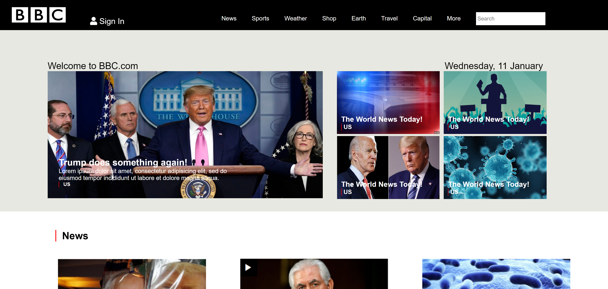

# BBC

Live code: http://kimflores-bbc.netlify.app

# How It's Made:
### Tech used: 
My task was to replicate the BBC homepage with **HTML** and **CSS**. I was given a screenshot as reference and implemented media queries for responsiveness.

# Lessons Learned:
Using floats was a bit tricky with the amount of images but marking up the site to organize the framework helped provide organization to the contents. Sections and using classes, and ids helped to place them were I wanted. The navigation bar with the media queries taught me to think of condensing the links to provide the ones that I deemed most important to the site as well as how the articles would fall in mobile view. 

# Examples:
Take a look at these couple examples that I have in my own portfolio:

JWLI: https://github.com/Kim-Flores/JWLI

Yelp: https://github.com/Kim-Flores/Yelp

Level Ground: https://github.com/Kim-Flores/Level-ground

Venture Beat: https://github.com/Kim-Flores/Venture-Beat

